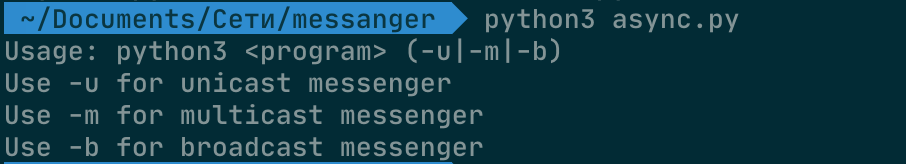
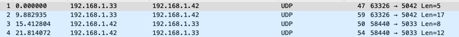
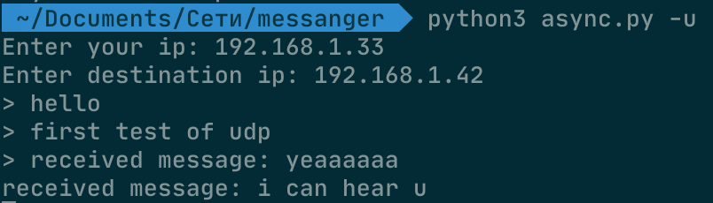
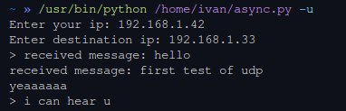
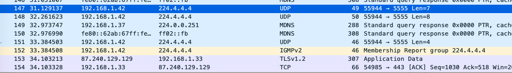
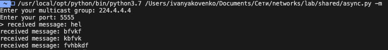
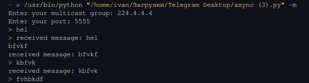
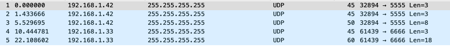
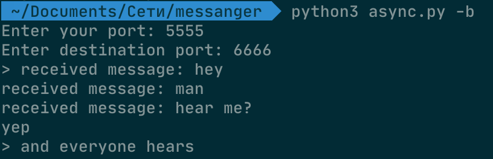
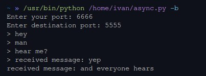

# Простой мессенджер на UDP
<blockquote>У меня есть для вас шутка. Возможно вы ее не поймете, но мне не важно)</blockquote>

---

## Задание 3б

Было написано маленькое приложение на питоне. Для реализации использован модуль **socket**.
Возможность общения вживую сделано через создание двух потоков: один постоянно отправляет то, что вводит пользователь (Sender). Второй же постоянно принимает пакеты UDP (Reciever). При запуске выбирается режим вещания



Пользователь сам вводит свой ip адрес и желаемый порт. В Unicast для синхронизации портов отправителя и получателя на расных копьютерах порт выбирается как 5000 + (последний октет ip). 

Максимальный размер дейтаграммы которую можно отправить одним пакетом **212992**

Получить это может операция

socket.getsockopt(socket.SOL_SOCKET, socket.SO_RCVBUF)

---

### Примеры общения
Находятся в файлах папок **kathara** (из моделирования работы сети) и **real_world** (примеры в моей сети на разных компьютерах)





---

## Задание 4а
Тот же код используется для отправки в режиме мультикаст. При создании Sender и Receiver инициализируются опции мультикаста, происходит добавление в группу.

```bash
mreq = struct.pack("4sl", socket.inet_aton(self.UDP_IP), socket.INADDR_ANY)
self.sock.setsockopt(socket.IPPROTO_IP, socket.IP_ADD_MEMBERSHIP, mreq)
```

Группу и порт пользователь выбирает при запуске программы


TTL по умолчании выставляется в 2. Это можно изменить, задав при запуске параметр:

```bash
# python3 async.py -m -ttl 1
# сам ttl высвляется в пакет:
self.sock.setsockopt(socket.IPPROTO_IP, socket.IP_MULTICAST_TTL, MULTICAST_TTL)
```
---

### Примеры

Сами снимки так же как и для unicast находятся в директориях **kathara** и **real_world**





---

## Broadcast
Самый простой режим рассылки пример приведен ниже:





---

## Примичание

На моделировании в Kathara удалось проверить лишь режим unicast. В силу того, что router не поддерживает отправку мультикаст сообщений, а в подсети есть лишь один terminal. Однако работоспособность все равно можно проверить по снимакам в папке **kathara**

---

*А может это я просто запутался с настройкой...*

Весь репозиторий и код доступен по ссылке: [GitHub](https://github.com/meyakovenkoj/udp_messenger)